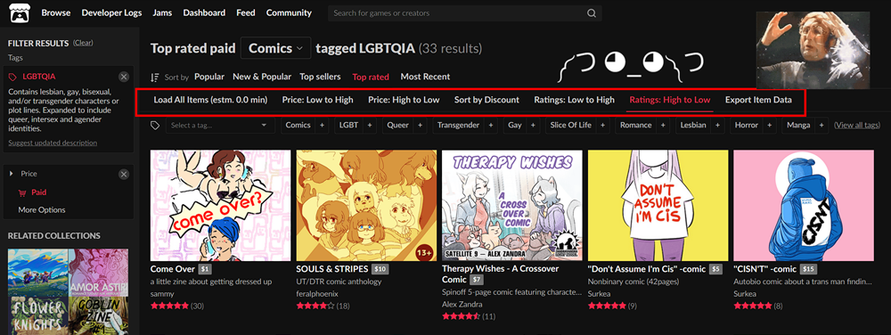

# Itch-Sort-And-Export

Quickly sort and/or export Itch.io game listings with a simple userscript.

## Features

- **Load All Games**: Dynamically loads all listed games on the current page.
- **Sort Games by Price**: sort games by highest or lowest price.
- **Sort Games by Discount**: Sort games by highest discount.
- **Export Game Data**: Export the loaded game data into a CSV file.

Should work for all item types like games, comics, books, etc.

## What is Itch-Sort-And-Export and how does it work?

Itch-Sort-And-Export is a userscript designed to enhance browsing on Itch.io by allowing you to sort and export game
listings efficiently. It integrates directly into the Itch.io webpage, providing a seamless and user-friendly
experience.

Userscripts are small JavaScript scripts that can be installed in your browser to modify the behavior of a webpage.
There are different extensions for userscripts like [Tampermonkey](https://www.tampermonkey.net/)
and [Greasemonkey](https://en.wikipedia.org/wiki/Greasemonkey). Itch-Sort-And-Export is only tested in Tampermonkey.

## Precautions

- **Filter Games First**: Before using the script features, please filter the game listings as needed to
  reduce the number of games. Loading a large number of games (e.g., over 1000) can take ages
  and may put unnecessary load on our beloved Itch.io servers. The estimated loading time is displayed next to
  the "Load All Games" button.
- **Frontend Changes**: The script might not work on all pages or might break with changes in Itch.io's frontend. I'll
  try to update the script if I notice any issues. If you encounter any problems or errors, please open an issue in the
  repository.

## Installation

1. Add the Tampermonkey extension to your
   browser: [Get it directly from the official website](https://www.tampermonkey.net/),
2. Click [HERE](https://github.com/6uhrmittag/Itch-Sort-And-Export/raw/main/Itch-Sort-And-Export.user.js) and you should
   be prompted to install the script.

## How to Use

The features work on any page under browse (like [itch.io/games](https://itch.io/games)
or [itch.io/comics](https://itch.io/comics)).

- **Loading all Games/Items**: To sort all existing items, you need to first load all items. Click the button and wait
  until all items are loaded. Please use a filter first to narrow down your search. Loading thousands of items will take
  ages and put unnecessary load on the Itch.io servers.  
  The estimated loading time is displayed next to the "Load All Games" button.  
  **To just sort or export the currently visible items, you don't need to load all items.**
- **Sorting Games/Items by Price**: Sorts items by highest/lowest price.
- **Sorting Games/Items by Discount**: Sorts items by highest discount (percentage value).
- **Exporting Data**: Exports all items as a CSV file. It automatically loads **all** items first!

## Debugging

For debugging, the script logs some debug output to the browser's console. This can help in troubleshooting and
understanding script behavior.

## Contributing

Feel free to open Issues and Pull Requests. I'll try to respond as soon as possible.

## License

This project is licensed under the MIT License - see
the [LICENSE](https://github.com/6uhrmittag/Itch-Sort-And-Export/blob/main/LICENSE) file for details.

## Acknowledgements

- [ChatGPT-4 by OpenAI](https://openai.com/gpt-4) - **ChatGPT wrote 99%** of the Code of the userscript. It even
  generated most of this README. We developed the Userscript in a single chat thread/context over 3 hours.
- [Itch.io](https://itch.io/) - For providing a fantastic platform for indie games.
- [Tampermonkey](https://www.tampermonkey.net/) - For making userscript management easy and accessible.
